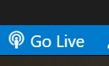

# 基础与环境配置

## 胎教级新手教程

在开始所有操作之前，请保证你操作系统已经打开了文件扩展名显示，以Windows系统为例：


这是同一个文件在显示和隐藏扩展名两种情况下的不同显示结果。如果你不知道怎么判断你的系统上该选项是否已经打开，那多半是没有打开，Windows默认情况下扩展名显示处于关闭状态。另一个判断方法是，如果你的文件图标不是空白文件图标，但你又没看到扩展名，那么就是关闭状态。

::: note 为什么要关闭扩展名的显示
一个文件的文件名最后一个`.`之后的部分是该文件的扩展名，以上文为例，`index.html`的扩展名就是`html`，在你隐藏扩展名的情况下，你看到的文件名其实是不完整的。
Windows系统需要根据文件类型来为该文件分配不同的图标，更重要的是，系统还需要根据文件类型来在你要求打开该文件（即双击）时以能够处理该文件的正确的程序打开这个文件。这些都需要Windows可以知道该文件是什么类型的文件，而最简单判断该文件类型的方法就是通过文件的扩展名。你可以尝试一下，将某个文件的扩展名改为`jpg`、`txt`，`mp3`等不同值，来观察图标的变化。

既然扩展名对操作系统有比较重要的用处，如果用户误操作改变了扩展名，就会使操作系统无法识别该文件，造成问题，因此Windows和MacOS在默认情况下都隐藏了扩展名。
:::

::: warning 我要如何打开扩展名显示？
你一定会问：那我该如何打开该显示呢？
请记住本课程的目标之一，是**使学生掌握正确运用搜索引擎解决问题的能力（换句话说，STFW）**。这也是为了让你在今后的课程中活下来。**请自行解决该问题**！
:::

好，现在在任意一个目录下新建一个文本文件，**并将该文件改名为`index.html`**。我依然要提醒你，后缀必须正确。然后用**系统自带的随便一个文本编辑器（例如，Windows的记事本）打开这个index.html文件**。请注意，你不能通过双击直接打开该文件，而是要用**文本编辑器**打开该文件，在Windows上，你可以先打开记事本，再通过拖动该文件到记事本中的方式，来打开该文件。

在文件中输入以下代码，你可以直接复制粘贴：
```html
<h1>Hello World!</h1>
```
**保存**，关闭文件。

然后你可以通过双击打开这个文件来了，如果不出意外，你的默认浏览器会启动，同时你应该可以看到这样的页面（根据操作系统和浏览器不同，可能略有区别）：


## Hello World我懂，那么我的IDE去哪里领？

在开始这个课程之前，如果你是一名已经饱受C语言和学校OJ摧残折磨的学生，你一定在等老师给你一个安装包，把环境安装好，然后在这个环境里开始愉快的编码。

但遗憾的是，本课程没有IDE来帮助你。当然也不能说没有，只不过你需要使用多个工具来完成你**看代码-编码-构建-运行-测试-调试**的完整流程。实际上这才是业界工作流的常态。以你们熟悉的C语言为例，我们会用`vim/emacs`来查看和编辑代码，用`gcc`来编译，用`ld`来链接，用`make`来进行项目的构建，用`gdb`来进行代码的调试。即便是大家使用十分顺手的宇宙第一IDE`Visual Studio`，也使用`cl`来编译，用`link`来链接你的代码。

::: warning 没有IDE编码我要死了
你们可能经常会听到老师说，现在的学生跟我们那个时候相比balabal……不幸的是，某些程度上这是事实。
之前曾有老师对学生连怎么看ip地址都不懂感到不可思议，我也会惊诧于很大一部分学生竟然连`dir`命令都不知道。

你们是Windows/MacOS下成长的一代，这令你们操作计算机的水平远远超过父辈。
但这也令你们习惯于操作系统帮你做任何事，习惯于双击打开任何一个文件，习惯于没有界面就不知道怎么编码。
然而对于大多数程序而言（尤其是你们以后要学习的这些），他们运行的环境从来都不需要一个界面来帮助辅助。
很多软件，只需要你在命令行下敲一行命令，就能完成很复杂的工作。

例如：`find . -name "*.c" | xargs grep "#include" | sort | uniq`

你可以在一个`linux`系统上跑以下这条命令，看看会有什么效果，而你在windows上，需要什么软件，你又需要什么样的操作才能完成相同的工作？

PS.Windows环境下你也可以用`MingW`或者`Cygwin`来跑一下。

对大多数人来说，图形化界面可以降低使用的成本，但对专业人员来说，图形化界面很多时候反而是他生产力的制约。

如果你从来不曾运行过命令行，那么现在是时候熟悉一下他了。
我推荐你使用[cmder](https://cmder.net/)这款软件，他提供多种linux的命令支持，对于Windows程序员来说，可以非常平滑的过度，不至于产生太大的负担。
:::

### 编辑器
从第一个例子你应该能够看出我们的代码可以直接在浏览器里“运行”。因此对我们来说，更重要的是一个可以方便我们查看和编写代码的工具。

这里建议你们使用[vscode](https://code.visualstudio.com/)。目前基本是前端开发的标配：

|编辑器|是否建议|原因|
|:-|:-|:-|
|vscode|建议|宇宙第一IDE，免费、社区活跃、插件极多、跨平台、功能强大，六边形战士|
|Sublime Text|建议|宇宙第二的前端开发工具，缺点是商业软件，社区和插件相对vscode要差不少|
|webStorm|可|宇宙第一Web开发全家桶的组件之一，优点是与IDEA同源，缺点是不如前两者活跃|
|Atom|可|github的跨平台编辑器，然鹅现在github已经可以在线打开vscode，所以你懂的|
|HBuilder|可|国产的前端编辑器，优点是国产、与uni-app框架深度绑定，缺点是社区活跃度远不如上面的软件|
|Ultra Editor / Notepad|不建议|对这些软件来说，他们的本职工作是文本编辑而非代码编辑|
|Dreamwaver|不建议|爷爷级的前端页面开发软件，而且要钱|
|Vim/Emacs|不建议|首先我敬你是条汉子，但如果你不知道这两个软件是什么，作为初学者我还是不建议你使用。你可以从前几个软件的vim模式开始|

我上课会用vscode作为工具展示。

当然，编辑器只是其中的一部分，一般这些软件都要搭配插件才是完全体，以vscode为例，我建议至少安装`Live Server`和`Mithril Emmet`这两款插件。
前者可以在你保存页面之后自动刷新浏览器，让你立刻看到你所作的修改。后者是一个强大的前端代码补全和生成工具，可以极大提升你的编码效率。
他们在很多编辑器上都有替代品，强烈建议你们安装。

此外本课程的很多资料（包括作业）都以Markdown形式提供，因此还建议你安装一个`Markdown Preview Enhanced`插件，可以方便你查看Markdown文件。
::: tip 关于Markdown
Markdown是现在互联网上技术博客最常用的格式，他格式比html简单，支持多种不同内容的展示，对码农尤其友好。

强烈建议你们开一个技术博客并用Markdown记录你的学习成长，四年之后你会发现这对你是一笔非常大的财富。
:::

### 浏览器
网页写好之后，不需要编译和链接等过程，你可以直接通过浏览器打开你写好的页面并查看效果（正如上面演示的那样）。
一般来说你选择顺手的浏览器就行，然而前端人头秃的一大原因在于，你需要适配不同的浏览器。
不过你也不用过分焦虑，我们可以把现有的浏览器大致分成几大类：

灰色的部分，都是已经退环境的浏览器，或者不属于主流的浏览器（例如UC），我们可以看出实际上现在主流的浏览器只剩下Chrome系、Firefox系和Saferi系这御三家。

其中Chrome和Chronium系列内核是目前市占率最高的浏览器种类，一般来说我们都优先适配他。

从这个角度，我们建议你一定要安装Chrome，配合系统内置的新Edge，可以选装Firefox。
因为某些众所周知的原因，Chrome的插件不容易获得，功能上会比较受限。而Firefox可以很好的补充这种不足。
Edge目前插件的支持比较弱，但整体功能呈现逐步上升的趋势，作为一个补充是很不错的。

另外如果你不是苹果用户，那就不用考虑Saferi。

事实上你不用担心无法适应这么多浏览器，他们的操作方式高度趋同，基本上你会用一个，就会懂得使用另一个。

::: note 那么国产的呢？
不推荐一些国产浏览器的原因，大家应该都懂的。
:::

## 让我们像一个真正的前端开发工程师那样开始工作吧！

作为一门希望教会大家解决实际问题，我很不愿意采用这种手把手教的方式，不过该做的事也要做，毕竟把未经训练的菜鸟送上战场是非常不道德的。
这种图文并茂的机会不常有，因此请大家务必要做一次。不要陷入眼睛会而手不会的误区。

不特别说明本讲义的环境都是：vscode+插件+Edge浏览器。

首先新建一个文件夹，在空白处右击选择“通过Code打开”打开你的vscode环境：


此时vscode会以你当前的目录作为项目的根目录。你可以通过侧边栏的按钮来向项目目录添加文件和文件夹，这里不再演示。
::: danger 为什么我没有这个菜单项？
你安装vscode的时候，没有把“通过Code打开加入右键菜单”勾选上，重新安装一次并勾选对应选项。
:::
::: danger 为什么我的vscode不是中文的？
你没有配置好中文环境，放心，vscode的中文化做得很好，当然英语依然是必不可少得技能。
怎么配置中文环境，请STFW。
:::

新建一个index.html文件，这个名字是有讲究的，一般网页的服务端将这个页面作为默认的入口，我们不要破坏这种默契，就使用这个名字。
打开这个文件，此时你看到的是一个空白的文件，请输入html，正常情况下你应该看到vscode给你的提示：


选中间那项，即`html:5`。

::: danger 为什么我没有弹出这个提示？
有两个可能的原因：
1. 你没有正确安装`Mithril Emmet`插件。不过按插件的说明，vscode已经内置的相关支持，我没有尝试过不安装插件是否能提供代码提示和补全的支持，你们可以试试。
2. 你文件的扩展名不是`.html`，记得前面说的吗？操作系统根据文件扩展名判断文件类型。vscode也一样，如果你不是`html`文件，他就不会启动相关的功能。
:::

你应该能看到窗口里多了一段代码，这是插件帮你进行了代码补全。

把前面写的那段`<h1>Hello World!</h1>`放到`<body>`和`</body>`中间，最后代码看起来会是这样：
```html
<!DOCTYPE html>
<html lang="en">
<head>
	<meta charset="UTF-8">
	<meta http-equiv="X-UA-Compatible" content="IE=edge">
	<meta name="viewport" content="width=device-width, initial-scale=1.0">
	<title>Document</title>
</head>
<body>
  <h1>Hello World!</h1>
</body>
</html>
```
暂停住你双击打开这个文件的冲动，现在请点击vscode界面右下方的`Go Live`按钮：



你的默认浏览器会打开这个页面，你应该看到类似的页面：


恭喜，你完成了新手任务。
::: danger 为什么我没有Go Live按钮？
因为你没有安装Live Server插件
:::

::: note 前端工作流
虽然本节题目是像一个前端开发工程师那样开始工作，然而实际上一个真正的前端项目远比你想象的更复杂

不过好歹我们用正确的工具和正确的方法开始了我们的旅程。
:::

## 你应该能够

1. 正确选择开发工具，使你的工作更加便利
2. 对html如何工作有个初步的印象
3. 正确配置你的开发工具和开发环境，能启动你的第一个页面